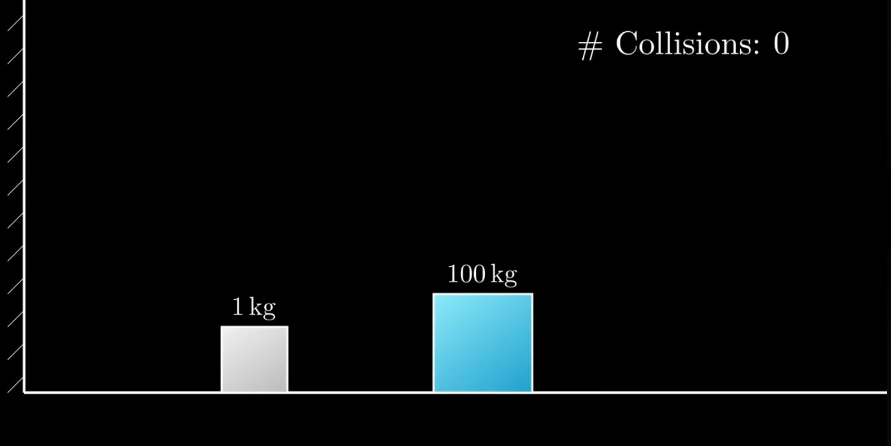
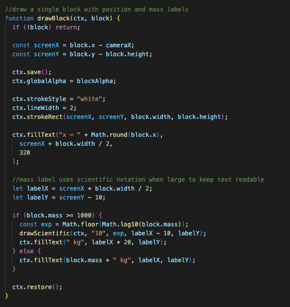
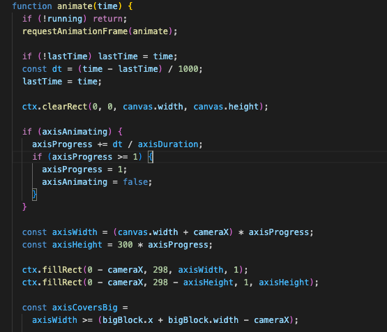
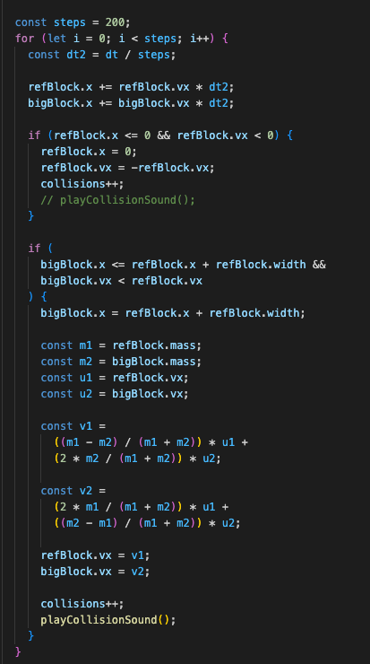
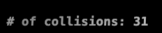
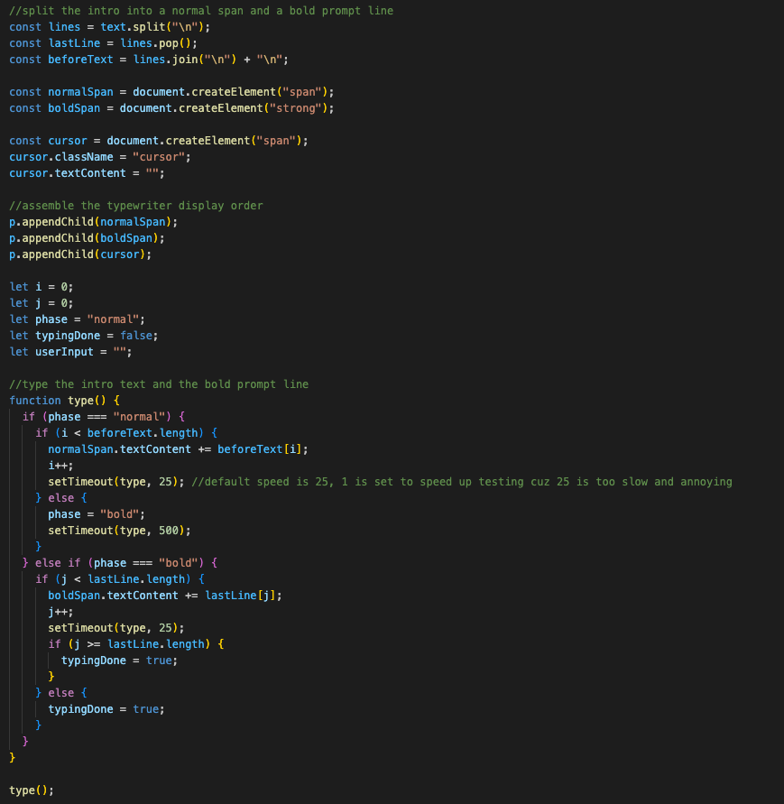
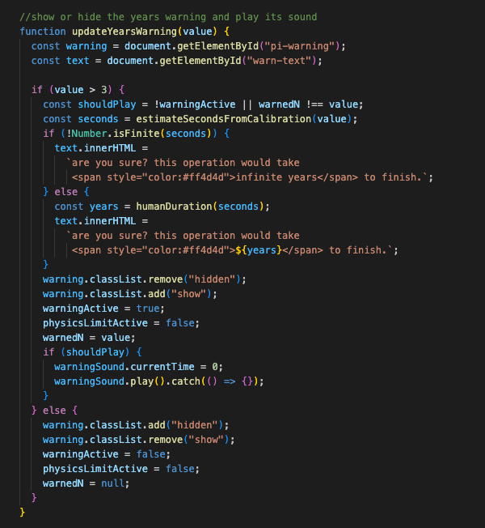
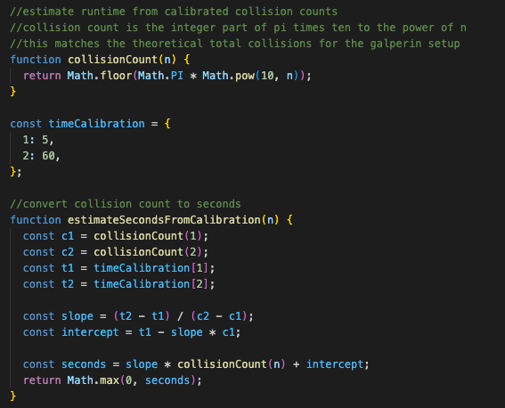
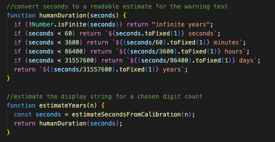

# The Galperin Algorithm

  

[Galperin, “Playing Pool with π (The Number π from a Billiard Point of View)”, 2003](https://rcd.ics.org.ru/RD2003v008n04ABEH000252)

  
In 2003, physicist Gregory Galperin published a research paper showing how an idealized elastic collision simulation between two blocks can be used to compute digits of π. The setup is famously absurd in its inefficiency, requiring exponentially more collisions to reveal each additional digit, and it has since become known in the mathematics community as one of the most comically impractical ways to approximate π.

  

# Galperin’s core setup

  

- Place a small block (mass = 1) in front of a wall.

- Place a second block to the right of it with mass = 100 to the power of (𝑛 − 1), where is how many digits of π you want to compute.

- Give the larger block a velocity moving toward the smaller one.

- The blocks collide elastically with each other and with the wall.

- Count how many total collisions occur.

- When the big block eventually heads off to the right forever, stop.

  

The number of collisions (written as digits) = digits of π.

  
  

| n | Mass ratio    | Collisions ≈ |
| - | ------------- | ------------ |
| 1 | 1 : 1         | 3            |
| 2 | 1 : 100       | 31           |
| 3 | 1 : 10,000    | 314          |
| 4 | 1 : 1,000,000 | 3141         |

 

----------------------
This project visualizes Gregory Galperin’s 2003 discovery:

> two blocks undergoing elastic collisions against each other and a wall encode the digits of π.

  

It’s intentionally the most inefficient π calculator in existence, which made it perfect for a fun portfolio project.

---

# How it works
A very brief explanation and translation of the code used to develop this
## *Physics Engine*
This project doesn’t use a physics library, everything is simulated manually inside an HTML `<canvas>`.

The canvas works like a digital chalkboard. Every frame, JavaScript draws pixels on it from scratch. The blocks are not “objects” on screen, they are simply rectangles being drawn over and over in slightly different positions.

to manage them, each block is stored in a JavaScript structure that keeps track of its:

-   mass
    
-   position (x)
    
-   size
    
-   velocity (speed)

(/assets/README.img/func1.png)

Then, using `fillRect()`, the simulation draws the block pixels on the canvas every frame.

### Movement

Each block is given an initial velocity/speed. 

every animation frame:

`x = x + vx * dt` 

-   If velocity is positive, the block moves right.
    
-   If velocity is negative, the block moves left.
    

This loop runs continuously using `requestAnimationFrame()`, which makes the motion smooth.

The result:  
the animation is literally just rectangles being repeatedly erased and redrawn very fast.

----------

### Collision between blocks

When the two blocks hit each other, they exchange energy exactly like real elastic objects.

This project uses the elastic collision equations published by **HyperPhysics (Georgia State University – Physics Dept.)** found in their article [*Elastic Collisions in One Dimension — Georgia State University (HyperPhysics)*](http://hyperphysics.phy-astr.gsu.edu/hbase/col1d.html) 

    v1' = ((m1 − m2) / (m1 + m2)) * v1 + (2m2 / (m1 + m2)) * v2
    v2' = (2m1 / (m1 + m2)) * v1 + ((m2 − m1) / (m1 + m2)) * v2

basically:

-   heavier objects keep more of their speed after impact.
    
-   lighter objects bounce away faster.
    
-   no energy is lost, nothing “sticks” or slows down.
    

The code simply replaces each velocity with the new values immediately after a collision.

----------

### Collisions With the Wall

The wall behaves differently.  
when the small block hits the left wall, its velocity is simply flipped:

`vx = -vx` 

This means it rebounds perfectly, without losing speed

----------

### Counting Collisions

Inside the simulation loop, every time:

-   the small block hits the wall, **or**
    
-   the two blocks collide,
    

the program increases a counter.

----------

### The xy axes

To make the simulation easier to follow visually:

-   the **x-axis slides outward** from left to right.
    
-   the **y-axis rises upward from the origin.**
    

only after the axes finish animating do the blocks fade onto the screen (this purely for aesthetics)

## *The typewriter mechanism*
The typewriter effect is implemented by progressively _revealing_ text rather than writing it all to the page at once.

The full message is stored as a normal string. Instead of injecting the entire string into the DOM (html) , we maintain a pointer (an index) representing *how many characters should currently be visible*. A timer (`setTimeout`) advances this pointer at fixed intervals.

on each tick:

1.  we increase the index by one.
    
2.  we update the paragraph so it contains the substring from the start of the text up to that index.
    
3.  the browser repaints, giving the appearance of typing.
    

Because the DOM (html content) is updated repeatedly (in a loop), the text appears in order without any animations or special libraries. The “cursor” you see is just a styled `` positioned at the end of the text. A CSS animation toggles its opacity so it blinks like a terminal prompt.

## *Notification System*
The notification system isn’t a normal alert sent by the browser, it’s entirely controlled by the simulation logic.

conceptually, the page always has a hidden notification element in the html. It only becomes visible when the program decides that the user needs to be warned.

here’s how it works:

1.  user enters a value for n and presses Enter.
    
2.  before starting the simulation, we check whether n exceeds a threshold (for example, n > 3).
    
3.  if it does, the simulation does not start.  
    Instead, we display the warning by toggling CSS classes on the notification element.
    

The notification box itself is just a normal `
` styled to look like a message. Its visibility is controlled purely through CSS:

-   *hidden* sets `opacity: 0` and pulls it slightly upward
    
-   *show* sets `opacity: 1` and slides it smoothly into place
    

The JavaScript simply switches between those states.

Inside the notification, we dynamically insert explanatory text. That text also includes a runtime estimate generated by the `estimateTime()` function, which approximates how long the calculation would take on a real machine. Depending on the result, it formats the time in **seconds, minutes, hours, days, or years**. (i will explain how it works later)

So the user sees something like:

> “Are you sure? This operation would take ~10 years to finish.”

Importantly, this warning also changes how input is handled:  
the program enters a “waiting” state instead of immediately running the simulation. The simulation only proceeds if the user presses Enter again, confirming they understand/read the warniing.

## *How the estimateTime() function works*
While it is only a subtle thing many wouldn't notice, it took quite some time (5 days) to completley finishing writing the algorithm and mechanism for how it works. Here's the rough scheme:

When the user enters a large value of n, the simulation will need an **insane number of collisions**, because the Galperin method grows _exponentially_.

Roughly:

- n = 1 => 3 collisions

- n = 2 => 31 collisions

- n = 3 => 314 collisions

- n = 6 => 314,159 collisions

- n = 10 => 31,415,926,535 collisions
    

So the question the UI is answering is:

> “if the browser keeps simulating, how long would it take until the final collision?”

the function doesn’t simulate , it only predicts.

### 1. Estimate how many collisions will happen

The number of collisions is approximately:

`pi × 10^n` 

so the function first estimates:

`totalCollisions = 3.14159 × 10^n` 

this comes directly from Galperin’s theorem.

----------

### 2. Assume a realistic speed for the browser

The simulation processes physics in tiny time-steps (dt per frame).  
that means the browser effectively does only **some number of collisions per second**.

So the function assumes something like:

`collisionsPerSecond = (depends on machine, animation speed, dt, etc.)` 

(I picked a value based on my own browser's performance.)

Then it estimates:

`seconds = totalCollisions / collisionsPerSecond` 

----------

### 3. Convert seconds into human-readable time

Instead of dumping something like:

454926200 seconds 

we just convert it to:

seconds => minutes => hours => days => years

and then choose the largest meaningful unit.

# Project Info
Duration: 1 month (1 week planning + 3 weeks developing)

 Languages used: JavaScript, CSS, and HTML

Developer: @theoneandonlysolo, *aka Adam Maad*

Purpose: Purely Educational

Text Editor: Visual Studio Code

Apps used: Canvas (for design), [stackedit.io](https://stackedit.io/) (for writing this README.md you're reading *right now*), [freesound.org](freesound.org) (for sound effects)

What I learned:
- how `<canvas>` works
- how to properly implement physics equations into JS
- how to divide frames/x-movement into substeps
- how to properly debug and fix specific bugs (took way too much time just finding the cause of certain bugs)
- small syntax errors/formatting I forgot about
- how to properly use async js and for i loops
- a new and interesting way to compute Pi

# Credits
-  [3Blue1Brown's video](https://www.youtube.com/watch?v=HEfHFsfGXjs&t=82s)  for inspiration

-   Gregory Galperin,  [_Playing Pool with π_ (2003)](https://rcd.ics.org.ru/RD2003v008n04ABEH000252)
    
-   HyperPhysics (Georgia State University – Physics Dept.) for their elastic collision equations
- StackOverflow and ChatGPT for teaching me how the `<canvas>` mechanics works, and how to implement the xy 2d plane
- My father for supporting me both emotionally and financially
- My teacher ([@Oumaimafisaoui](https://github.com/Oumaimafisaoui)) for teaching me everything I know  about HTML, CSS and JS up until now 

# Incoming planned updates
- better sound effects
- bug fixing (send me a message if you manage to find a bug)
- maybe changing the font of the text that shows generated Pi digits? (It just feels off for some reason)
